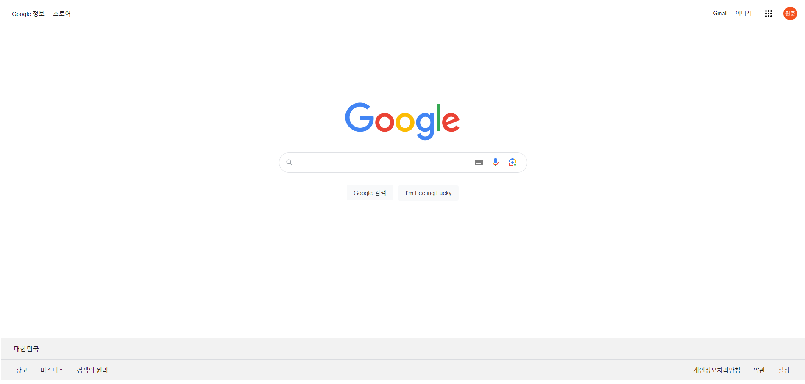

    <h2>Google 메인페이지 클론 코딩 </h2>

### Issue

> - html, css 만을 이용해서 구글 홈페이지 클론
> - Header의 gmail 버튼 >> 임의의 gmail 페이지로 이동

### ToDoList

- [ ] header, footer, content 생성
- [ ] css 스타일링
- [ ] gmail 페이지 생성 후 하이퍼링크 설정

### 이번 주차 컨셉

> -  관리자 모드로 실제 구글 화면과 최대한 유사한 구조의 태그 사용
> -  실제 화면에서 쓰이는 스타일 속성 그대로 사용
> -  태그의 순서는 기본적으로 container >> wrapper >> box 순(추가 필요 시 임의로)

### 추가로 구현한 점
> - header, footer의 텍스트 및 검색창, 버튼 호버링 스타일 구현
> - 버튼 클릭 시 스타일 변경 구현
> - 하이퍼 링크가 있어야 하는 항목들 호버링 시 마우스 포인터 변경

### 보완해야 할 점
> - 검색창 textfield의 위치 디테일 수정 필요
> - 검색창에서 enter 실행 시 줄 바꿈 되는 현상
> - 스타일 단위가 px이라 반응형이 아닌 점 + 개인 모니터 환경에 따라 다르게 보임

### 실제 결과물

